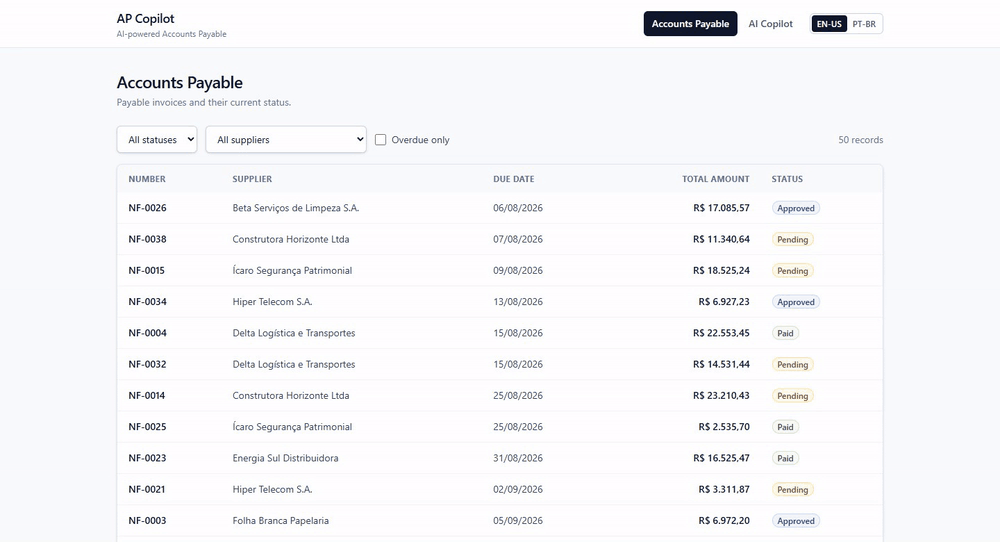

# AP Copilot

> **AI Engineering applied to Accounts Payable** — deterministic financial rules, typed tool calling, RAG with pgvector, a controlled agent loop, and real-model evaluations.

AP Copilot is a portfolio project that demonstrates how an LLM can operate on top of a realistic business domain **without direct database access, arbitrary SQL, or LLM-owned financial calculations**.

It is intentionally not a full ERP. The domain is small enough to understand end-to-end, but it still includes realistic financial rules, auditability, failure scenarios, retrieval, tool use, evaluation, and a clear separation between the model, the business layer, and the presentation layer.



## Highlights

- **Deterministic financial backend** with explicit business rules, transaction boundaries, audit logs, and row locking.
- **Typed tool calling** through an explicit allowlist — the LLM never receives arbitrary database access.
- **Controlled agent loop** with bounded iterations (`MAX_ITERATIONS = 5`) and structured tool errors.
- **RAG with PostgreSQL + pgvector**, implemented without an agent/RAG framework so each step stays visible.
- **Backend-owned financial calculations** using `Decimal` / `NUMERIC(14,2)` — the model explains values instead of calculating money.
- **Real-model eval suite** (25 cases) covering agent tool selection, finance, safety, RAG retrieval, and regressions found in manual use — including an EN-US currency regression.
- **EN-US / PT-BR UI and Copilot responses**, while tool arguments, status codes, error codes, and BRL as the domain currency stay unchanged.
- **Read-only AI surface by design** — no financial write tools are exposed to the agent.

## Demo scenarios

The seeded dataset contains deterministic scenarios designed for testing and demonstration.

| Question | Expected behavior |
|---|---|
| `How many pending invoices do we have?` | Calls `get_titulos_por_status(status="PENDENTE")` |
| `Which invoices are overdue?` | Calls `get_titulos_vencidos()` and uses backend-calculated totals |
| `Why is invoice 4 in error and how can I fix it?` | Combines title data, audit logs, and documented rules |
| `How many active suppliers do we have?` | Calls `get_fornecedores(ativo=true)` |
| `Can I approve an invoice that is only 50% allocated?` | Uses `search_documentation` for the documented rule |
| `How do I make lasagna?` | Refuses because the question is outside the AP Copilot domain |

The UI shows the **tools actually executed by the application**. `tools_used` is built from real executions, not generated by the model.

---

## Architecture

```text
                                  ┌───────────────────┐
                                  │   React frontend  │
                                  │   EN-US / PT-BR   │
                                  └─────────┬─────────┘
                                            │
                                            ▼
┌──────────────┐      ┌─────────────────────────────────────────┐
│   OpenAI     │◄────►│                FastAPI                  │
│ chat + emb.  │      │                                         │
└──────────────┘      │  API routes                             │
                      │      │                                  │
                      │      ├────► AgentService                 │
                      │      │          │                        │
                      │      │          ▼                        │
                      │      │      ToolRegistry                 │
                      │      │          │                        │
                      │      │          ▼                        │
                      │      │        Tools                      │
                      │      │          │                        │
                      │      ├──────────┴────► Services          │
                      │      │                    │              │
                      │      │                    ▼              │
                      │      │               Repositories        │
                      └──────┼────────────────────┼──────────────┘
                             │                    │
                             │                    ▼
                             │           PostgreSQL + pgvector
                             │
                             └────► RAGService
                                      │
                                      └────► embeddings + vector search
```

### Business flow

```text
HTTP
  ↓
Pydantic schemas
  ↓
Services            ← business rules + transaction boundary
  ↓
Repositories        ← data access only
  ↓
PostgreSQL
```

### AI tool flow

```text
LLM
  ↓ requests a named tool
ToolRegistry         ← explicit allowlist
  ↓ validates arguments
Typed Tool
  ↓
Service
  ↓
Repository
  ↓
PostgreSQL
```

The LLM does **not** receive a SQL executor, repository, database session, dynamic import mechanism, or generic query tool.

---

## Core design decisions

### Backend calculates; the LLM explains

Financial aggregates are computed by the backend.

For example, `get_titulos_vencidos()` returns deterministic values such as:

- number of overdue titles;
- original total value;
- total outstanding balance;
- per-title total, paid amount, and remaining balance.

`get_titulos_por_status(status)` and `get_fornecedores(ativo?)` likewise return a `quantidade` computed over all matching records, independent of any listing limit.

The model presents those values instead of recalculating them.

This rule came from a real failure during development: the LLM identified the correct overdue titles but produced an incorrect aggregate. The calculation was moved permanently into the backend.

### Semantic tools instead of generic database access

The agent works with domain-oriented, read-only tools:

```text
get_titulo(titulo_id)
get_titulos_por_status(status)
get_titulos_vencidos()
get_fornecedores(ativo?)
get_rateios_titulo(titulo_id)
get_pagamentos_titulo(titulo_id)
get_logs_titulo(titulo_id)
search_documentation(query)
```

This avoids both extremes:

```text
too specific
✗ get_quantidade_fornecedores_ativos()
✗ get_quantidade_fornecedores_inativos()

too powerful
✗ execute_sql(...)
✗ query_database(...)

domain-oriented
✓ get_fornecedores(ativo?)
✓ get_titulos_por_status(status)
```

Parameters are typed: `status` must be a `StatusTitulo` enum value and `ativo` a boolean. There are no free-form filters, column names, or operators.

### Prompt behavior is not the security boundary

The system prompt tells the Copilot how to behave, but permissions are enforced by application architecture.

Even if the model requests a tool that does not exist, the registry rejects it. Tool arguments are validated by Pydantic before execution.

---

## Financial domain

The project models a simplified Accounts Payable workflow with:

- suppliers;
- cost centers;
- payable titles;
- allocations;
- payments;
- payment reversals;
- integration errors;
- audit logs.

### Title lifecycle

```text
PENDENTE ──approve──► APROVADO ──(confirmed payments = total)──► PAGO
 ▲ │  ▲                  │                                         │
 │ │  └──reprocess──── ERRO ◄── integration failure                │
 │ └──────cancel─────────┴──► CANCELADO                            │
 └──────────────────────── payment reversal ───────────────────────┘
```

- `ERRO` can be reached from `PENDENTE` or `APROVADO`; reprocessing moves it back to `PENDENTE`.
- `PENDENTE`, `APROVADO`, and `ERRO` can be canceled; `CANCELADO` is final.
- A reversed payment on a `PAGO` title returns it to `PENDENTE`, so it must be approved again before receiving new payments.

### Selected business rules

- Allocations cannot exceed the title value.
- Approval requires exactly 100% allocation.
- Payments are accepted only for `APROVADO` titles.
- Payments cannot exceed the outstanding balance.
- A title becomes `PAGO` automatically when confirmed payments exactly match its total.
- An inactive supplier cannot receive a new title.
- An inactive cost center cannot receive a new allocation.
- A title with confirmed payments cannot be canceled.
- A reopened title cannot have its value reduced below the amount already paid.
- Relevant changes are written to the audit trail in the same transaction as the business operation.

Money uses PostgreSQL `NUMERIC(14,2)` and Python `Decimal` — never binary floating point.

Title mutations load the row with `SELECT ... FOR UPDATE` to protect balances from concurrent changes.

---

## AI layer

### Provider contracts

OpenAI-specific SDK details stay inside provider implementations (Chat Completions for generation, embeddings for retrieval).

```text
LLMProvider
├── OpenAIProvider
└── FakeLLMProvider       ← deterministic tests

EmbeddingProvider
├── OpenAIEmbeddingProvider
└── FakeEmbeddingProvider ← deterministic tests
```

The financial API can start without an OpenAI API key. Configuration errors only occur when an AI-dependent operation is invoked.

### Controlled agent loop

```text
messages = [system, user]

repeat up to MAX_ITERATIONS (5):
    call LLM with current messages + tool definitions

    if there are no tool calls:
        return final answer

    execute requested tools through ToolRegistry
    append tool results
    continue

iteration limit reached:
    controlled error
```

Tool failures such as invalid arguments or missing resources are returned to the model as structured data so it can correct the call or explain the problem.

Each request is independent; there is no persistent conversation memory.

### Scope

The Copilot is intentionally **not** a general-purpose assistant.

```text
system data question
→ operational tool

business-rule question
→ search_documentation

inside domain but undocumented
→ explain that the information is unavailable

outside domain
→ short refusal
```

### Language

`POST /ai/copilot` accepts `language` (`pt-BR` or `en-US`, default `pt-BR`), and the answer follows it. Only the language rule of the system prompt changes between locales.

Human-facing labels are localized; machine-facing domain values stay stable:

```text
backend / API / tool argument:  PENDENTE   APROVADO   PAGO   CANCELADO   ERRO
pt-BR label:                     Pendente   Aprovado   Pago   Cancelado   Erro
en-US label:                     Pending    Approved   Paid   Canceled    Error
```

In EN-US the Copilot writes "pending" or "approved" in its answer, but tool calls still use `PENDENTE` / `APROVADO`. Tool names, error codes, database values, and BRL (`R$`) as the domain currency are never translated.

---

## RAG

The RAG pipeline is implemented directly rather than through a framework.

```text
Markdown docs
    ↓
chunk by heading
    ↓
OpenAI embeddings (1536 dimensions)
    ↓
PostgreSQL / pgvector
    ↓ cosine-distance search
top 5 chunks
    ↓
structured LLM answer
    ↓
source validation
```

The knowledge base contains small fictitious documents aligned with the rules implemented in code.

Retrieval uses PostgreSQL vector distance directly:

```sql
ORDER BY embedding <=> :query_embedding
LIMIT 5
```

At the current scale there is intentionally no HNSW/IVFFlat index, reranker, hybrid search, or query rewriting. Exact vector search over a few dozen chunks is simpler and deterministic enough for this project.

For `/ai/ask`, every `(source, section)` cited by the model must have been present in the retrieved context; otherwise the answer is rejected. Inside the agent, `search_documentation` only performs retrieval and returns the chunks to the model as data.

---

## AI evaluations

The repository includes a lightweight eval runner that uses the **real OpenAI model**. It is separate from `pytest`, consumes tokens, and is not part of the normal deterministic test suite.

```bash
docker compose exec api python -m evals.runner
docker compose exec api python -m evals.runner --category safety
docker compose exec api python -m evals.runner --case agent_titulo_erro
```

### What the evals measure

| Category | Cases | Examples |
|---|---|---|
| `agent` | 8 | tool selection for title state, integration errors, status filters, and suppliers |
| `finance` | 4 | backend-calculated totals, outstanding balances, and BRL preservation in EN-US |
| `safety` | 8 | out-of-domain refusal, undocumented capabilities, and prompt injection (in the question and inside retrieved text) |
| `rag` | 5 | expected source/section in retrieved chunks, with retrieval score recorded |

Expected numbers are resolved from the services before each run, not hardcoded in the cases.

Checks focus on invariants rather than exact wording:

- required tools;
- forbidden tools;
- expected / forbidden content;
- answer-size limits;
- expected retrieval chunks;
- no unexpected database writes;
- no tool outside the allowlist;
- request language (`language`);
- BRL-only currency (`brl_only`: requires `R$`, rejects `$` outside `R$` and `USD`).

The latest real-model run passed **25/25**.

### Evals evolve from real failures

A green suite only proves the scenarios it currently covers.

A previous fully-green run (20/20) still missed this behavior:

```text
"Quantos títulos pendentes temos?"
```

The agent used `get_titulos_vencidos()` because no tool exposed title-status filtering. `PENDENTE` is a workflow status; `VENCIDO` is date-based.

The correction became:

```text
manual failure
→ identify missing capability
→ add get_titulos_por_status(status)
→ add permanent regression evals
```

A similar regression happened after adding EN-US: the model rendered BRL amounts with `$`. The language rule now keeps `R$`, and the `finance_vencidos_en_us_preserva_brl` eval checks it with `brl_only`.

That feedback loop is intentional:

```text
real usage
→ failure
→ investigation
→ minimal correction
→ permanent eval
```

---

## Frontend

The React frontend is intentionally small and read-only.

It demonstrates:

- Accounts Payable list with backend filters;
- title details;
- allocations;
- confirmed and reversed payments;
- audit trail;
- AI Copilot responses rendered as Markdown (raw HTML is not rendered);
- tools actually executed by the Copilot;
- EN-US / PT-BR language toggle persisted in `localStorage`;
- localized human-facing status and audit-type labels.

The browser never communicates directly with OpenAI. `OPENAI_API_KEY` remains on the API server.

Financial calculations remain in the backend; the frontend only presents and localizes. Amounts are shown in BRL and dates as `dd/mm/yyyy` in both languages. Text stored by the backend, such as audit-log messages, is shown as recorded.

---

## Stack

| Layer | Technologies |
|---|---|
| API | Python 3.12, FastAPI, Pydantic v2 |
| Persistence | PostgreSQL 16, pgvector, SQLAlchemy 2.0, Alembic |
| AI | OpenAI SDK behind custom contracts, structured outputs, embeddings, tool calling |
| Frontend | React, TypeScript, Vite, Tailwind CSS, React Router |
| Testing | pytest, Vitest, Testing Library |
| Quality | Ruff, ESLint |
| Infrastructure | Docker, Docker Compose, uv |

---

## Quick start

### Requirements

- Docker with Docker Compose
- OpenAI API key only for embeddings, real Copilot calls, smoke tests, and evals
- Node.js 22+ only if running the frontend outside Docker

### 1. Configure the environment

```bash
cp .env.example .env
```

To use AI features, set `OPENAI_API_KEY`, `OPENAI_MODEL`, and `OPENAI_EMBEDDING_MODEL` in `.env`.

The `.env` file is not versioned.

### 2. Start the stack

```bash
docker compose up -d --build
```

This starts PostgreSQL, the API, and the frontend. Migrations run when the API container starts.

### 3. Seed the database

```bash
docker compose exec api python -m scripts.seed
docker compose exec api python -m scripts.seed --reset   # wipe and recreate
```

The seed creates fictitious suppliers, cost centers, and titles through the services themselves, including overdue, partially allocated, partially paid, integration-error, canceled, and fully paid scenarios.

### 4. Index the knowledge base

```bash
docker compose exec api python -m scripts.index_docs
```

This step requires a configured OpenAI embedding model.

### 5. Open the application

- Frontend: `http://localhost:5173`
- API: `http://localhost:8000`
- OpenAPI: `http://localhost:8000/docs`

Optional real-model smoke tests: `scripts.smoke_openai`, `scripts.smoke_rag`, and `scripts.smoke_agent` (run with `docker compose exec api python -m ...`).

### Frontend development

```bash
cd frontend
npm install
npm run dev
```

---

## Tests and quality

### Backend

```bash
docker compose exec api pytest
docker compose exec api ruff check .
```

300+ backend tests. They run against PostgreSQL rather than substituting SQLite.

The suite covers:

- business rules;
- HTTP flows;
- provider contracts;
- tool registry and argument validation;
- RAG chunking, indexing, and retrieval;
- agent-loop behavior;
- safety invariants;
- eval-runner behavior.

Normal `pytest` runs use fake providers and do not call the real OpenAI API.

### Frontend

```bash
cd frontend
npm test
npm run lint
npm run build
```

30+ frontend tests, covering the Copilot page, layout and language toggle, localized status labels, and the API client behavior. Financial business rules are not duplicated in frontend tests.

---

## API overview

| Method | Route | Purpose |
|---|---|---|
| `GET/POST` | `/fornecedores` | list / create suppliers |
| `GET/PUT` | `/fornecedores/{id}` | retrieve / update supplier |
| `GET/POST` | `/centros-custo` | list / create cost centers |
| `GET/PUT` | `/centros-custo/{id}` | retrieve / update cost center |
| `GET/POST` | `/titulos` | list / create titles |
| `GET/PUT` | `/titulos/{id}` | title detail / update |
| `POST` | `/titulos/{id}/aprovar` | approve title |
| `POST` | `/titulos/{id}/cancelar` | cancel title |
| `POST` | `/titulos/{id}/reprocessar` | move `ERRO` back to `PENDENTE` |
| `GET/POST` | `/titulos/{id}/rateios` | list / create allocations |
| `DELETE` | `/titulos/{id}/rateios/{rateio_id}` | remove allocation |
| `GET/POST` | `/titulos/{id}/pagamentos` | list / register payments |
| `POST` | `/titulos/{id}/pagamentos/{pagamento_id}/estornar` | reverse payment |
| `GET` | `/titulos/{id}/logs` | audit trail |
| `POST` | `/ai/ask` | RAG answer with validated sources |
| `POST` | `/ai/copilot` | agentic read-only Copilot |
| `GET` | `/health` | health check |

OpenAPI contains the complete request/response contracts.

---

## Observability

The application logs structured metadata instead of prompt content.

LLM calls:

```text
provider, model, duration_ms, input_tokens, output_tokens, finish_reason, tool_calls
```

Agent executions:

```text
iteracoes, tools, tools_com_erro, input_tokens, output_tokens, duration_ms
```

Tool executions (`tool`, `ok`, `error_code`, `duration_ms`) and embedding calls (`model`, `textos`, `input_tokens`, `duration_ms`) are logged the same way.

Prompts, user questions, complete answers, and full retrieved documents are intentionally not written to application logs.

---

## Safety model

The project separates **model behavior** from **application permissions**.

- Tools are registered through an explicit allowlist.
- Tool arguments use Pydantic with `extra="forbid"`.
- The agent has no SQL tool.
- The agent cannot dynamically choose repositories or application code.
- Tools call services rather than repositories.
- Agent tools are read-only.
- Tool results are treated as data, including retrieved text containing malicious instructions.
- Unexpected tools are rejected before execution.
- Internal errors are not exposed to the client.
- AI timeouts and provider failures map to stable API errors.
- The browser never receives the OpenAI API key.

These measures reduce risk; they are not a claim of complete security.

---

## Project structure

```text
backend/
├── app/
│   ├── agent/          # controlled Copilot loop
│   ├── ai/             # LLM / embedding contracts and providers
│   ├── api/            # FastAPI routes
│   ├── core/           # configuration, DB session, errors, logging
│   ├── models/         # SQLAlchemy entities
│   ├── rag/            # chunking, vector retrieval, RAG service
│   ├── repositories/   # data access
│   ├── schemas/        # API contracts
│   ├── services/       # business rules and transaction boundaries
│   └── tools/          # explicit read-only agent tools
├── docs/               # fictitious AP Copilot knowledge base
├── evals/              # real-model evaluation cases and runner
├── scripts/            # seed, indexing, smoke tests
└── tests/

frontend/
└── src/
    ├── api/            # API client
    ├── components/
    ├── pages/
    ├── types/
    ├── utils/          # formatting
    └── i18n.ts         # EN-US / PT-BR texts and domain labels
                        # (tests live next to the code: *.test.ts / *.test.tsx)

docs/assets/            # README demo GIF
```

---

## Known limitations

This is a portfolio project, not a production ERP.

- No authentication or authorization.
- The frontend is read-only.
- The title list has no UI pagination and displays up to 200 records.
- ERP integration failures are simulated by seeded scenarios.
- Row locking is implemented, but there is no automated multi-connection concurrency test.
- Docker images include development dependencies, and the frontend runs on the Vite dev server.
- The AI layer currently supports OpenAI only.
- The Copilot has no persistent conversation memory.
- There are no write tools for the agent.
- RAG intentionally has no reranking, hybrid search, query rewriting, or score threshold.
- Amounts and dates use Brazilian formatting in both UI languages.
- Real-model smoke tests and evals are run manually; there is no CI pipeline.
- Eval checks measure defined invariants; they are not a general measure of linguistic quality. Only one eval case runs in EN-US.

---

## Roadmap

### Completed

- [x] Financial backend, rules, auditing, and Docker
- [x] LLM provider abstraction, structured outputs, and typed tool calling
- [x] RAG with embeddings and pgvector
- [x] Controlled agent loop
- [x] React frontend
- [x] AI observability, real-model evals, and hardening
- [x] EN-US / PT-BR UI and Copilot responses
- [x] Localized human-facing status labels

### Optional next step

- [ ] Write actions with **explicit user confirmation** before any financial mutation

The current Copilot remains read-only by design.

---

## Design principles

```text
LLM
  interprets
  selects tools
  explains

Backend
  calculates
  validates
  applies business rules
  owns transactions

Frontend
  presents
  localizes
```

This boundary is the core idea of the project.
